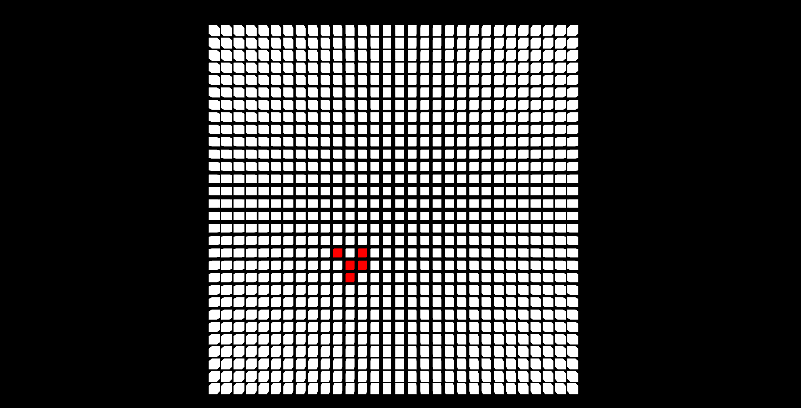

# Game of Life
Classic model of cellular automaton on `JavaScript` with using `Three.js`

The "game" is a zero-player game, meaning that its evolution is determined by its initial state, requiring no further input. 

This game have simple `rules`:

1. Any live cell with fewer than two live neighbours dies, as if caused by under-population. 
2. Any live cell with two or three live neighbours lives on to the next generation.
3. Any live cell with more than three live neighbours dies, as if by over-population.
4. Any dead cell with exactly three live neighbours becomes a live cell, as if by reproduction.

